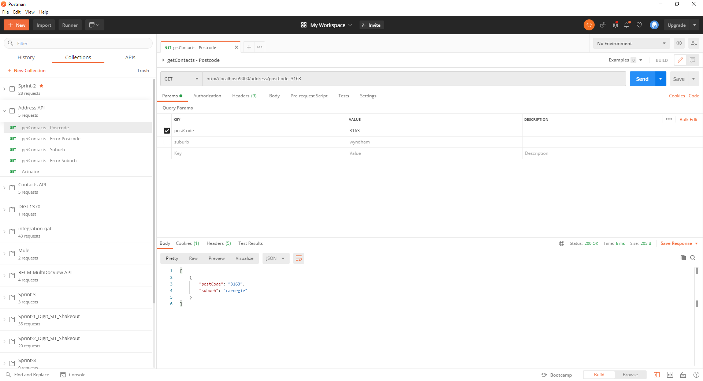
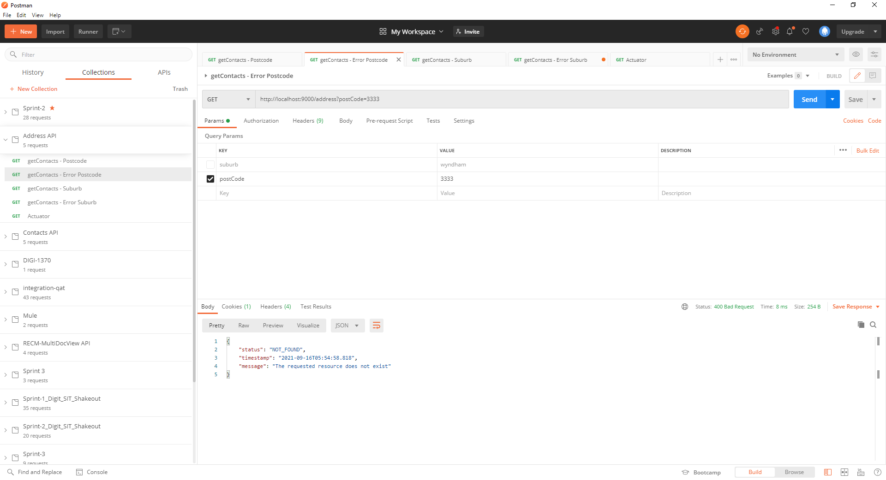
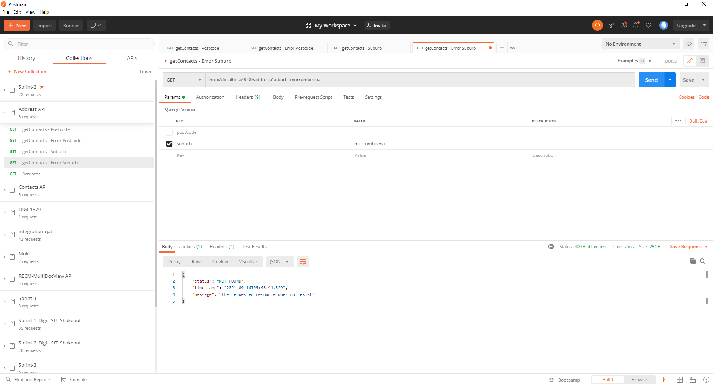
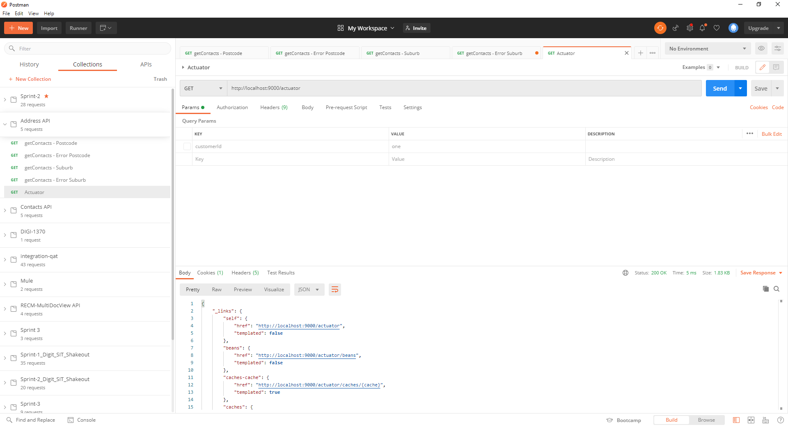
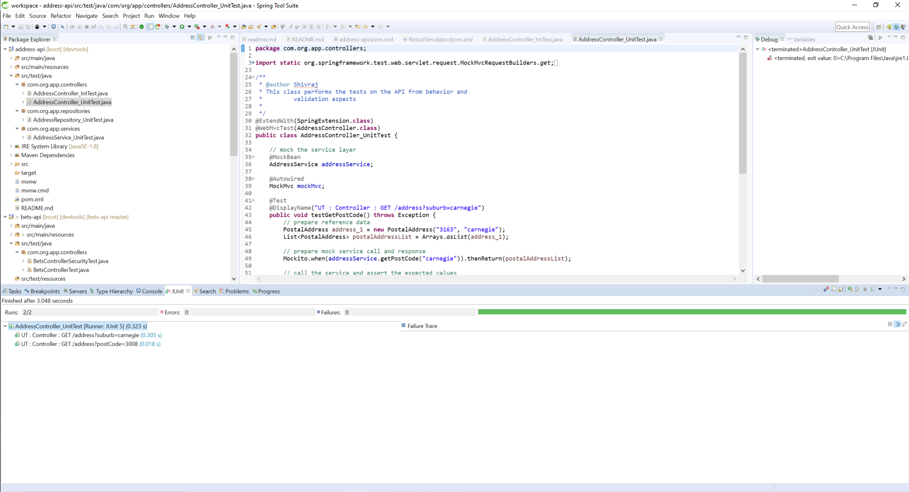
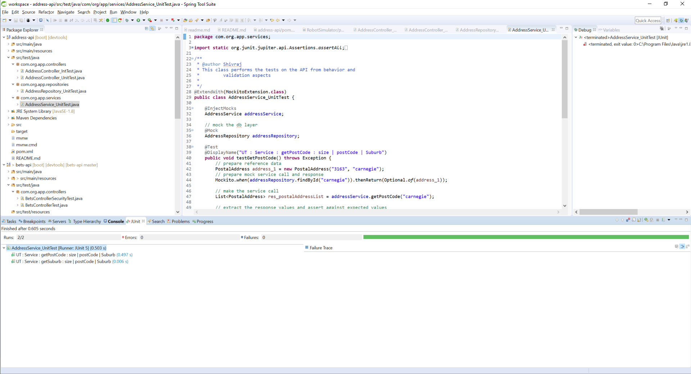
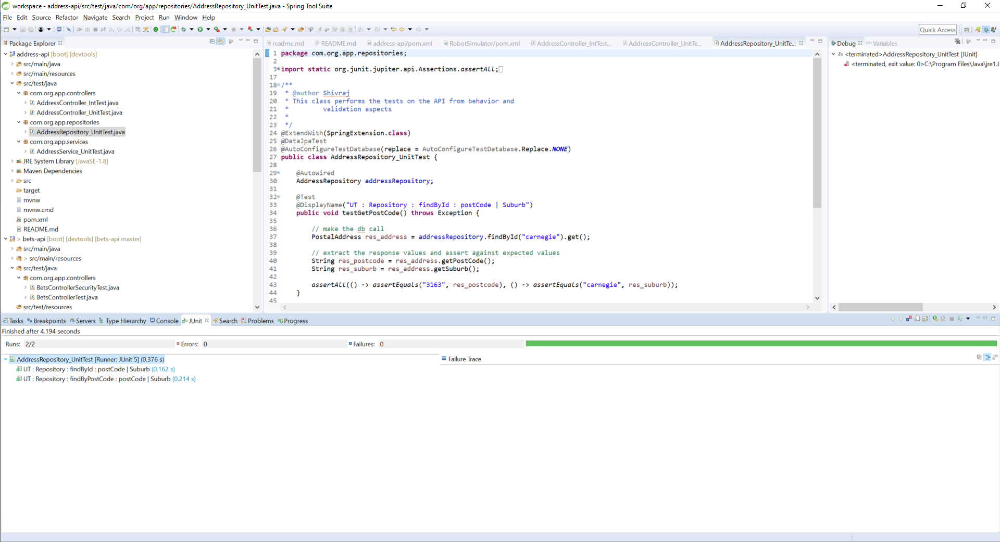
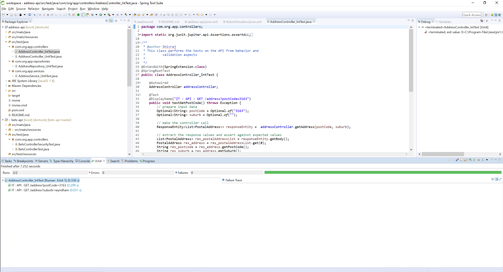

Read Me
=======

Project Title: Address API
------------------------------
The application is a work in progress to develop a API to fetch address details when either a postal code or suburb is passed as part of request params. Also, it should have capability to accept new address details additions.

API Description
----------------
The main goal of this API is to enable clients to:
- fetch suburb details if postal code is passed as a request parameter.
- fetch postcode details if suburb is passed as a request parameter.
- post new address details (postcode, suburb) for future reference in a secured manner.

Current State:
--------------
The current development state is completely functional for below requirements:
- fetch suburb details if postal code is passed as a request parameter.
- fetch postcode details if suburb is passed as a request parameter.

To-Do:
------
Enhance the solution for below requirement:
- Attach Swagger module for API documentation.
- Enhance the solution to enable client to post new address details (postcode, suburb) for future reference.
- Add security layer.
- Develop different profiles to be enabled to be deployed on different environments.
- Add more test cases for unit tests and system tests to validate all the boundary conditions and code coverage.
- Come up with build strategy to be deployed on AWS instance.

Technology details:
-------------------
Project is implemented with below technologies:
* Java 8 platform as Programming language.
* Springboot - 2.6.0 release version.
* H2 in-memory database is used as persistence layer.
* Junit 5 for unit, integration and system testing.
* Apache Maven 3.1.1 as Build tool.
* Manager-Service-DAO design pattern is used for the implementation of API. 

Features & Usage:
----------------
* Actuator feature is incorporated to provide out of the box features of spring boot.
* DevTools feature is incorporated to prove hot deployment while developing.
The API integration test postman collection is placed in project root directory : Address API.postman_collection.json

API End points:

URL : http://localhost:9000/address
request params : postCode / suburb - Either of them is mandatory.

Get it run:
-----------
**Pre-requisites** : 
- Java 8 installed and configured on destination computing device.
- Apache Maven 3.1.1 installed and configured on destination computing device.

* The application is built using Maven Tool. The users can execute below maven commands in command line from project root folder :\address-api\*

1. To validate > compile> run tests

	mvn test

	This command validates, followed by comiling source code, executes the tests written in tests folder within project. The junit framework uses the sunfire plugin to publish the results on console and writes the filewise reports in folder \address-api\target\surefire-reports

2. To validate > compile> run tests > package

	mvn package

	This command executes all the lifecycle process described for mvn test followed by packaging the code to a jar file placed in \address-api\target\ target folder. The fat jar name will be address-api-0.0.1-SNAPSHOT

3. To execute, navigate into target folder \address-api\target\

	java -jar address-api-0.0.1-SNAPSHOT.jar

	This command kicks in the application executable and now the server is ready to accept user requests.

Sample execution:
-----------------
1. Happy scenario : When postcode is passed; corresponding suburb within the address details is retrieved correctly. 

2. Negative scenario : When non existing postcode is passed; Correct status and message it relayed back. 

3. Happy scenario : When suburb is passed; corresponding postcode within the address details is retrieved correctly.  

4. Negative scenario : When non existing suburb is passed; Correct status and message it relayed back. 

5. Actuator; various out of box features of Spring Boot 

Tests:
------
* *Unit tests* and *integration tests* are written to test the application for happy scenarios. These are available in the tests folder within project.

*Screenshots of the unit testing:*

1. Controller unit testing results:

2. Service layer unit testing results:

3. Data layer unit testing results:

4. Integration testing results:
